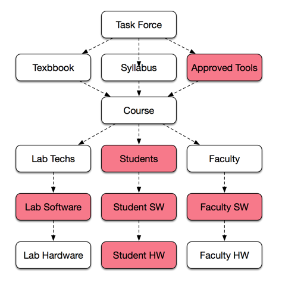

Committee Charter
#################

..  include::   /references.inc

The CIS department offers a large number of computer courses, each requiring
specific software. For some courses, the selection of the required software is
easy: the course covers a particular software package. For other courses, it is
largely left to the individual instructor to identify the software to be used.
However, as a department, we must ensure that any software product we use in a
course adequately meets the needs of the course, can be installed on lab
machines, and is properly licensed. 

Here is a diagram showing our current situation:

Our course offerings are driven by WECM_ and ACGM_ guidelines. Our choice of
software products should be driven by industry needs, and we can tap the
Advisory Committee for guidance there.

In this diagram, the Task Force is charged with managing the selection of a
textbook and design of a master syllabus for each course we offer. Since the
selection of software for a course is as important as these other two items,
the Task Force should also identify suitable software for use in the course as
well. The Technology Committee was proposed in an effort to meet this need.

Integrating Software
====================

Once a software product is identified, there are three groups of people who
need to deal with that software:

    * Lab Techs will need to install the products at the required campuses.

    * Faculty will need to install the products on their work systems (desktops
      of laptops)

    * Students will need to install the products on their personal systems.

In each case, the hardware involved is diverse, and the installation process
complicated as a result.

    * Lab Systems: Currently Dell desktops, some with removable drives for
      specific uses

    * Faculty machines: ACC owned Dell desktops, and personal desktop/laptop
      systems

    * Students: a wide selection of systems and OS versions

        * Students are using PC, Mac and Linux systems, especially in software
          development courses.

            * Many students are showing up with Windows 8/10, and new Macs. 

Departmental Database
*********************

The Technology Committee should ensure that a database of course materials is
maintained, and holds the essential data needed to properly manage our course
offerings:

    * Master Syllabus
        
        * template driven that can create a basic class version on demand
          
            * school approved content standard content

            * term specific data derived from the school database

        * Instructor modifications should be easy to add
          
    * Textbook

        * ISBN, Author, Publisher, Cover image

    * Software products

        * Approved versions

        * Lab installation procedures

        * Test procedures to confirm operational status
          
        * Student/faculty installation procedures

..  note::

    Individual faculty usually take on the responsibility for assisting
    students in setting up their systems for a course. In many cases those
    faculty produce installation guides for their courses. This information
    should be maintained in a central database, and should feed the department
    web site so both students and staff can benefit from this information.

Software Product Approval Process
*********************************

The Technology Committee should administer a form to be used to propose that a
software product be made available for a course. That form should provide
justification for the selection, and serve as a checklist to make sure the
requirements for each product are met.

Proposals should be voted on by the Task Force after clearing the Technology
Committee.

Integration with CIS Website
****************************

All of the data maintained by the Technology Committee should be integrated
into the CIS website, so it is readily available to both students and staff.
Since much of the data we seek to maintain is derived from the school DATATEL
system, we should access this data directly from that system.

However, accessing DATATEL is a cumbersome process, and in the interim, I have
set up a Python web spider to scrape data from the published ACC website. This
is a starting point for further development of a department level data base.

Pages currently on this site indicate what we can do by simple web scraping.

Software Issues
***************

The process of managing our software set is more complex than many folks
realize. More often then I care to remember, there have been issues getting a
course started as we sort out problems with the lab setup at a particular
campus. In spite of often heroic efforts by lab techs, the situation is
sometimes very difficult to handle.

The process of creating a master image for a particular campus/lab is
complicated, and both the installation and testing procedures need to be
automated as much as is practical. Our lab personnel are often overloaded
between semesters trying to get set up for the following term. I have watched
this situation for over a decade, and feel that we can and should do more to
manage this. 

Maintaining installation/test documentation and recording conflict issues will
go a long way toward managing this recurring situation.

Provisioning tools
==================

There are many new open-source system configuration management products being
used in large scale installations that could be explored to make this process
easier to get through. Examples are Ansible_, Puppet_, and Chef_ in the
Linux/Mac world, and a newcomer, Chocolatey_ in the PC world. I have been using
ANsible_ to manage my Mac and Linux systems for several years, with good
results. 

Such systems are in large scale use in many Linux/Mac organizations, but
unfortunately, the Windows world is playing catch up. Our lab techs have been
exploring Microsoft solutions for the Windows.

